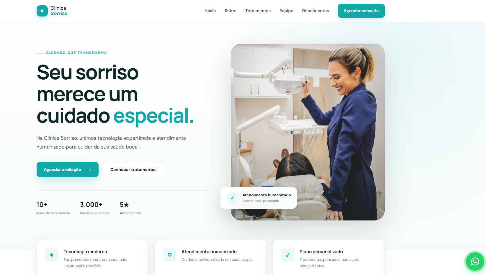

## 👨‍💻 Autor

Desenvolvido por **Riolly Mikael**.

* **GitHub:** [@riollymikael](https://github.com/riollymikael)
  

# 🦷 Clínica Sorriso — Landing Page Odontológica

<div align="center">

  <!-- IMAGEM DE PREVIEW -->
  

  <br><br>

  <!-- BOTÕES DE ACESSO RÁPIDO -->
  <a href="https://riollymikael.github.io/clinica-sorriso-landing-page/">
    
  </a>
  <a href="https://github.com/riollymikael/clinica-sorriso-landing-page">
    
  </a>
  

</div>

---

## 📌 Sobre o Projeto

Uma landing page moderna, altamente conversiva e 100% responsiva para a **Clínica Sorriso**, desenvolvida para apresentar serviços odontológicos de excelência, equipe médica qualificada e agendamento prático de consultas.

### ✨ Diferenciais do Layout:
* ⚡ **Hero Section:** Chamada para ação (CTA) estratégica.
* 👨‍⚕️ **Corpo Clínico:** Cards detalhados dos médicos da clínica.
* 🏥 **Tratamentos:** Apresentação clara de procedimentos e especialidades.
* 💬 **Depoimentos:** Prova social para geração de confiança.
* 📱 **Layout Responsivo:** Perfeito para desktops, tablets e smartphones.

---

## 🛠️ Tecnologias Utilizadas

* **HTML5:** Estruturação semântica e acessível.
* **CSS3:** Design moderno, CSS Grid, Flexbox e animações.
* **JavaScript:** Interatividade e validações.

---

## 📂 Estrutura do Repositório

```text
clinica-sorriso-landing-page/
│
├── assets/
│   └── images/          # Imagens do site e preview
├── css/
│   └── style.css        # Estilos globais
├── js/
│   └── script.js        # Lógica JavaScript
├── index.html           # Página principal
└── README.md            # Documentação

